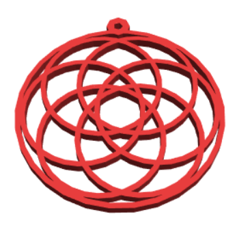

## المقدمة

في هذا المشروع ، ستستخدم BlocksCAD لتصميم قلادة ثلاثية الأبعاد. تستخدم القلادة تصميمًا هندسيًا يعتمد على "زهرة الحياة" ، وهو تصميم غالبًا ما يوجد في الفن التاريخي.

BlocksCAD هو محرر نماذج ثلاثية الأبعاد يمكنك استخدامه في متصفح الويب على جهاز الكمبيوتر أو الجهاز اللوحي. يمكنك سحب وإفلات كتل التعليمات البرمجية لتصميم نماذج ثلاثية الأبعاد التي يمكن تصديرها للطباعة ثلاثية الأبعاد.

إذا كان لديك حق الوصول إلى طابعة ثلاثية الأبعاد ، فيمكنك طباعة القلادة الخاصة بك. القلادة صغيرة ولا تستخدم سوى القليل من الفتيل(مادة الطباعة) ، وهي سريعة في الطباعة ثلاثية الأبعاد.

### ما الذي ستصنعه

تبدو القلادة النهائية على النحو التالي:

تحتوي القلادة على طوق في الأعلى بحيث يمكنك وضعها على عقد أو حبل.

يبلغ قطر القلادة 40 مم ، بالإضافة إلى الطوق للتعليق. يبلغ سمكها 2 مم ، لذا ستتم الطباعة ثلاثية الأبعاد بسرعة كبيرة.

بعد هذا المشروع ، ستتمكن أيضًا من برمجة التصميم الخاص بك وإنشاء قلادة مخصصة.

--- collapse ---
---
title: ما الذي ستحتاج إليه
---

### الأجهزة

+ طابعة ثلاثية الأبعاد ولون فتيل(مادة الطباعة) بلون من اختيارك
+ عقد أو حبل لتعليق القلادة عليه

### البرمجيات

+ يمكن إكمال هذا المشروع في متصفح ويب باستخدام BlocksCAD [blockscad3d.com/editor/](https://www.blockscad3d.com/editor){: target = "_ blank"}

--- /collapse ---

--- collapse ---
---
title: ما الذي ستتعلمه
---

+ كيفية استخدام حلقات تكرار `العد ` لإنشاء أنماط هندسية
+ كيفية استخدام كتل `مختلف` لإنشاء الاطواق من الاسطوانات

--- /collapse ---

--- collapse ---
---
title: معلومات إضافية للمعلمين
---

إذا كنت بحاجة إلى طباعة هذا المشروع، فالرجاء استخدام الإصدار [الصديق للبيئة عند الطباعة](https://projects.raspberrypi.org/ar-SA/projects/blockscad-pendant/print){:target="_blank"}.

قم بتنزيل الكود البرمجي للمشروع النهائي من [https://rpf.io/p/ar-SA/blockscad-pendant](https://rpf.io/p/ar-SA/blockscad-pendant).

--- /collapse ---
