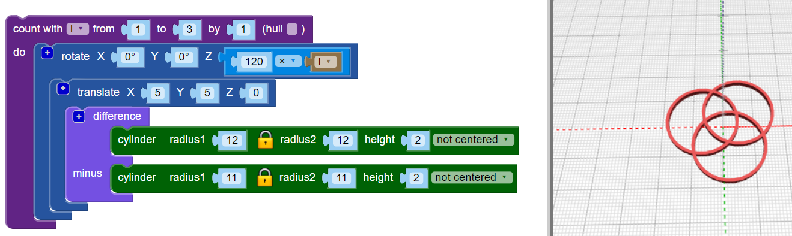

## أضف المزيد من الأطواق

يستخدم التصميم ستة أطواق متقاطعة ، ويتم نقل كل حلقة من المركز وتدويرها بعدد مختلف من الزوايا.

--- task ---

في التصميم النهائي ، لا يوجد طوق مركزي: حيث يتم نقل جميع الأطواق خارج المركز.

أولاً ، `ترجمة`{:class="blockscadtransforms"} (تحريك) الحلقة الأولى في الموضع.

الآن الطوق قليلا خارج المركز.

--- /task --- --- task ---

تحتاج إلى نسخ متعددة من هذا الطوق ، تدور حول المركز. أولاً ، قم بإنشاء ثلاث أطواق متساوية المسافات:

أضف حلقة `العد `{:class="blockscadloops"} لإنشاء ثلاث أطواق. لمسافة الاطواق ، أضف كتلة `تدوير `{:class="blockscadtransforms"} بين الحلقة `العد` والكتلة `ترجمة`. `العد` يضبط المتغير `i` من 1 إلى 3. `تدوير` ينقل كل حلقة بمقدار `120 × i` درجات، بحيث توزع هذه الحلقات الثلاث بالتساوي حول 360 درجة من الدائرة (360 / 3 = 120).

انظر إلى التعليمة البرمجية وتأكد من فهمك لكيفية عملها.

--- /task --- --- task ---

التصميم النهائي يحتوي على ستة اطواق بدلا من ثلاثة أطواق. قم بتغيير التعليمات البرمجية الخاص بك بحيث يقوم بإنشاء ستة أطواق متساوية المسافات.

--- hints ---
 --- hint ---

تغيير حلقة `العد `{:class="blockscadloops"} بحيث تعمل ست مرات بدلاً من ثلاث مرات. ستحتاج الأطواق الست إلى مسافات متساوية حول 360 درجة.

--- /hint --- --- hint ---

تحتاج إلى تغيير الحلقة التكرارية لتعمل من 1 إلى 6 وتحرك بمضاعفات 60 درجة (360 / 6 = 60):

--- /hint --- --- hint ---

يجب أن تبدو التعليمة البرمجية الخاصة بك بالشكل التالي:

--- /hint ------ /hints --- --- /task ---	
	
