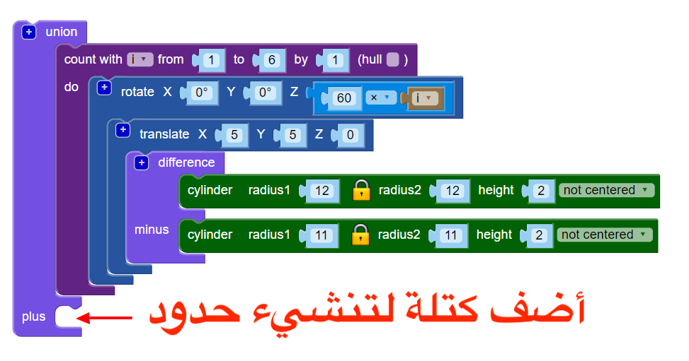

## أضف حدًا

بعد ذلك ، أضف حدًا حول حافة التصميم.

--- task ---

أنشئ طوقًا مركزيًا يلامس حواف التصميم. يمكنك إما القيام بالعمليات الرياضية لمعرفة ما يجب أن يكون عليه نصف قطر الدائرة، أو يمكنك فقط إنشاء دائرة وتغيير نصف القطر حتى يعمل. أي من الحالتين جيد!

استخدم الكتلة البرمجية `union`{:class="blockscadsetops"} لربط الحدود بأطواق أخرى:

--- hints ---
 --- hint ---

استخدم الكتل البرمجية `الاسطوانية` و `اختلاف` لإنشاء الطوق.

يبلغ نصف القطر لكل الأطواق الستة 12 مم ، لذا يجب أن تكون الحدود الأسطوانة التي تصنعها أكبر من ذلك. يمكنك محاولة ضبط نصف القطر إلى 24 مم.

لصنع طوق، نصف قطر الاسطوانة الثانية``في بلوك`مختلف`يجب أن يكون أصغر من نصف قطر الأولى`اسطوانة`.

--- /hint --- --- hint ---

اضبط حجم الأسطوانات ` ` حتى يلمس الطوق الحدودي الحواف الخارجية للأطواق الداخلية الستة.

--- /hint --- --- hint ---

نصف قطر يجب أن يكون حول `20`. (في المقدمة، قالت إن القطر النهائي سيكون 40 ملليمتراً!)

يمكنك أيضًا استخدام الرياضيات لحساب القطر.

يبلغ قطر كل حلقة داخلية 24 ملم. إذا اجتمعت الأطواق في مركز القلادة ، فستحتاج حدود الدائرة الى ان يكون نصف قطرها 24 ملم. لكن الأطواق الداخلية تتداخل لأنها تترجم 5 ملم على طول المحورين X و Y.

هذا يزيل قسما من نصف القطر. هذا القسم على القوس 5 مم من الأصل، لذلك نعرف أننا بحاجة إلى إزالة 5 مم من 24 مم. هذا يعني أن نصف القطر الداخلي للطوق الحدودي يجب أن يكون 19 مم.

الرياضيات مفيدة جداً عندما تحتاج إلى أن تكون دقيقاً. ولكن من الجيد فقط تغيير الأشياء حتى تحصل على النتيجة التي تحتاجها.

--- /hint ------ /hints --- --- /task ---
