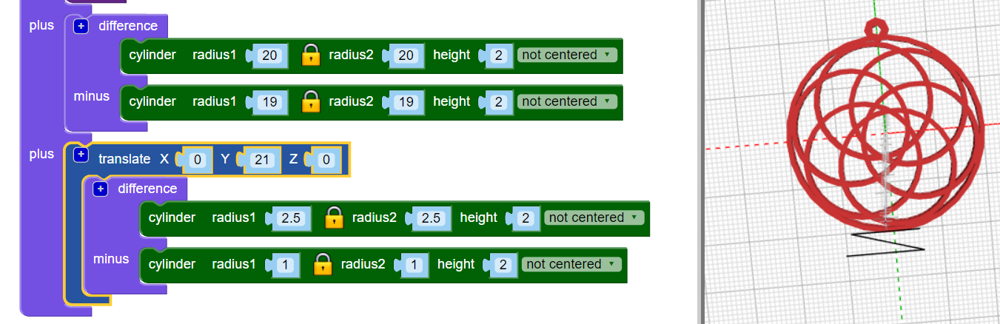

## أضف طوقا معلق

الآن ، أضف طوقًا صغيرًا معلقًا يمكنك من خلاله ربط حبل لصنع قلادة.

نصيحة: هذه التعليمات البرمجية تضيف وصلة صغيرة يمكن استخدامها مع موضوع القلادة المرنة. إذا كان لديك حبل أكبر أو سلسلة أكبر، يمكنك تعديل التعليمات البرمجية لإنشاء حلقة معلقة أكبر.

--- task ---

أضف طوقًا صغيرًا معلقًا يمكنك وضع خيط من خلاله.

انقر فوق `+` في الجزء العلوي من كتلة `union` لإضافة قسم آخر.

في الوقت الحالي ، فإن وضع الطوق المعلق ليس مرضيًا للغاية.

--- /task --- --- task ---

أضف كتلة `rotate`{:class="blockscadtransforms"} لتحريك الأطواق الداخلية بحيث يتركز الطوق المعلق على واحدة من الفجوات بينها.

--- /task ---	

	
