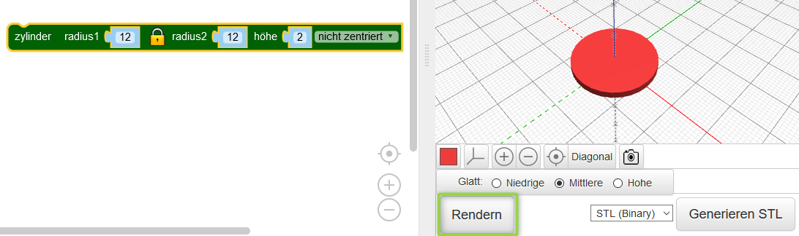
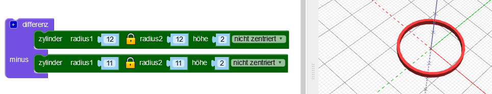

## Einen Reifen erstellen

Das Design verwendet sechs ineinandergreifende Reifen in der Mitte und einen größeren Reifen um die Außenseite. Der Anhänger ist 4 cm breit, plus dem Ring zum Aufhängen. Er ist 2 mm dick und kann daher sehr schnell in 3D gedruckt werden.

Erstelle zuerst einen einzelnen inneren Reifen.

--- task ---

Öffne den BlocksCAD-Editor in einem Webbrowser. [blockscad3d.com/editor/](https://www.blockscad3d.com/editor/){:target="_blank"}.

Du kannst Blöcke ziehen und ablegen um Code zu schreiben, um 3D-Objekte zu erstellen.

--- /task --- --- task ---

Erstelle einen `Zylinder` mit einem Radius von `12` und einer Höhe von `2` (die Einheit hier ist Millimeter).

`Zylinder` werden automatisch entlang der X- und Y-Achse zentriert. Wähle `nicht zentriert` aus, damit der Anhänger auf der Oberfläche sitzt. (Das bedeutet, dass der Wert auf der Z-Achse größer als 0 ist.).

Klicke nach jeder Änderung deines Codes auf die Schaltfläche **Rendern**, um die Ergebnisse zu sehen.

--- /task --- --- task ---

Benutze jetzt `Differenz`{:class="blockscadsetops"} um einen kleineren `Zylinder` aus der Mitte zu entfernen. Dies erzeugt einen Reifen:

Wenn du möchtest, kannst du auf das farbige Quadrat klicken um die Farbe zu ändern, die im Betrachter verwendet wird. Dies hat keinen Einfluss auf die Farbe des Anhängers, da diese von der Farbe der verwendeten Filaments abhängt.

--- /task ---
	
	
