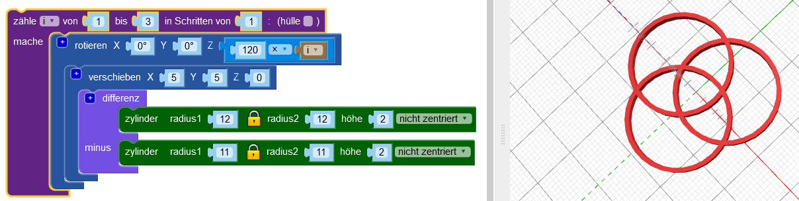

## Füge mehr Reifen hinzu

Das Design verwendet sechs, sich kreuzende Reifen, und jeder Reifen wird aus der Mitte herausbewegt und um eine andere Anzahl von Grad gedreht.

--- task ---

Im endgültigen Design gibt es keinen zentralen Ring: Die Reifen werden alle aus dem Zentrum versetzt.

Zuerst, `verschiebe`{:class="blockscadtransforms"} den ersten Ring in Position.

Jetzt ist der Reifen etwas außerhalb der Mitte.

--- /task --- --- task ---

Du benötigst mehrere Kopien dieses Reifens, gedreht um die Mitte. Erstelle zuerst drei gleichmäßig verteilte Reifen:

Füge eine `Zähler`{:class="blockscadloops"}-Schleife hinzu, um drei Ringe zu erstellen. Um die Ringe auf Abstand zu bringen, füge einen `rotieren`{:class="blockscadtransforms"}-Block zwischen der `Zähler`-Schleife und dem `verschiebe`-Block ein. Der `zähle`-Block setzt die Variable `i` von 1 bis 3. `Rotieren` bewegt jeden Reifen um `120 x i` Grad, so dass die drei Reifen gleichmäßig auf den 360 Grad eines Kreises verteilt sind (360 / 3 = 120).

Schau dir den Code an und stelle sicher, dass du verstehst, wie er funktioniert.

--- /task --- --- task ---

Das fertige Design hat sechs statt drei Reifen. Ändere deinen Code so, dass er sechs gleichmäßig verteilte Reifen erzeugt.

--- hints --- --- hint ---

Ändere die `zähle`{:class="blockscadloops"}-Schleife, so dass sie sechsmal läuft statt dreimal. Die sechs Reifen müssen einen gleichmäßigen Abstand um 360 Grad haben.

--- /hint --- --- hint ---

Du musst die Schleife ändern um von 1 bis 6 zu laufen und um vielfache von 60 Grad (360 / 6 = 60) zu verschieben:

--- /hint --- --- hint ---

Dein Code sollte so aussehen:

--- /hint --- --- /hints --- --- /task ---	
	
