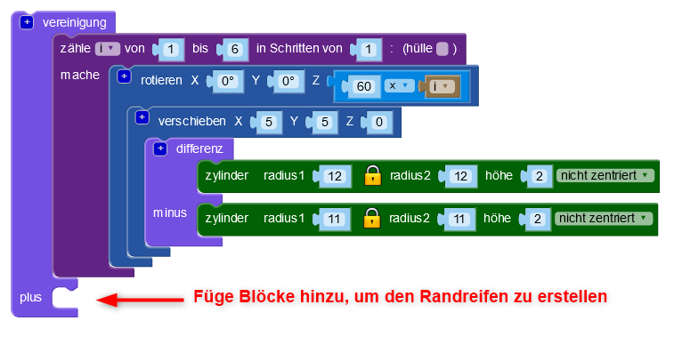
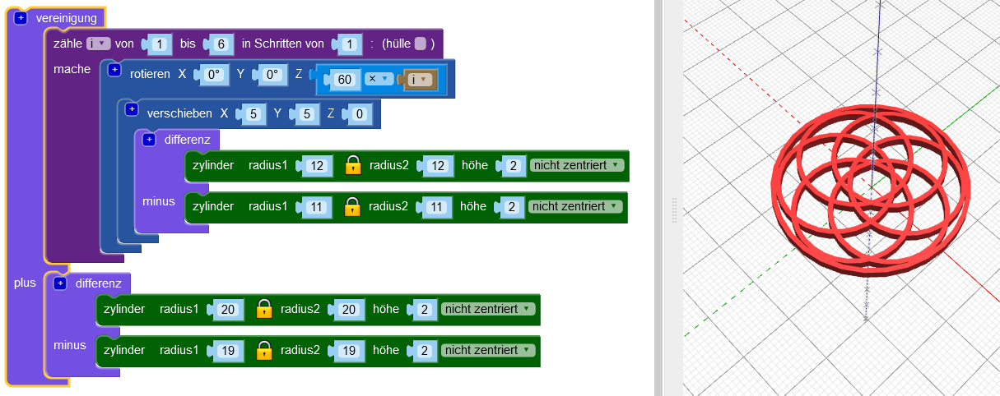

## Füge einen Rand hinzu

Als nächstes füge einen Rahmen um den Rand des Designs hinzu.

--- task ---

Erstelle einen zentrierten Reifen der die Kanten des Designs berührt. Du kannst entweder mathematisch ausrechnen, wie groß der Radius des Kreises sein muss oder du kannst einfach einen Kreis erstellen und den Radius solange ändern, bis er passt. Beides ist in Ordnung!

Nutze den `Vereinigung`{:class="blockscadsetops"}-Block, um den Rand mit den anderen Ringen zusammen zu fügen:

--- hints --- --- hint ---

Verwende die `Zylinder`- und `Differenz`-Blöcke, um den Reifen zu erzeugen.

Die sechs Reifen haben jeweils einen Radius von 12mm, also muss der Randzylinder, den du erstellst, größer sein. Du könntest versuchen den Radius auf 24mm zu setzen.

Um einen Reifen herzustellen, muss der Radius des zweiten `Zylinders` im `Differenz-`-Block 1mm kleiner sein als der Radius des ersten `Zylinders`.

--- /hint --- --- hint ---

Passe die Größe der `Zylinder` solange an, bis der Randring gerade so die äußeren Kantten der sechs inneren Reifen berührt.

--- /hint --- --- hint ---

Der Radius sollte um `20` liegen. (In der Einleitung hieß es, dass der fertige Anhänger einen Durchmesser von 40 mm haben wird!)

Du könntest auch Mathematik nutzen, um den Durchmesser zu ermitteln.

Der Durchmesser jedes inneren Rings beträgt 24 mm. Wenn sich die Ringe in der Mitte des Anhängers treffen würden, müsste der Randreifen einen Radius von 24 mm haben. Die inneren Reifen überlappen sich jedoch, da sie entlang der X- und Y-Achse um 5 mm verschoben sind.

Dadurch wird ein Abschnitt aus dem Radius entfernt. Dieser Abschnitt befindet sich auf dem Bogen, 5 mm vom Ursprung entfernt, sodass wir wissen, dass wir 5mm von 24mm entfernen müssen. Dies bedeutet, dass der Innenradius des Randreifens 19 mm betragen sollte.

Mathematik ist wirklich nützlich, wenn du genau sein musst. Aber es ist in Ordnung, die Dinge so lange zu ändern, bis du das gewünschte Ergebnis erhälst.

--- /hint --- --- /hints --- --- /task ---
