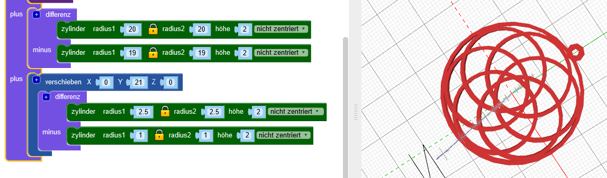
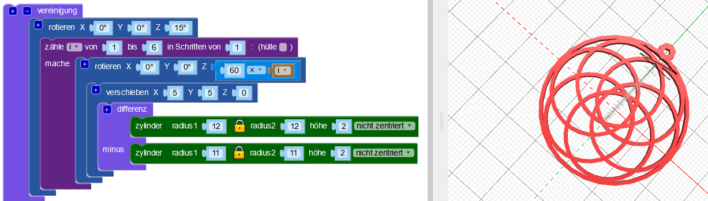

## Füge einen Aufhänge-Ring hinzu

Füge nun einen kleinen Hänge-Ring hinzu, durch den du eine Schnur oder eine Halskette fädeln kannst.

Tipp: Dieser Code fügt einen kleinen Ring hinzu, der mit elastischem Halskettenfaden verwendet werden kann. Falls du eine dickere Schnur oder Kette hast, kannst du den Code anpassen um einen größeren Aufhänge-Ring zu erzeugen.

--- task ---

Füge einen kleinen Ring hinzu, durch den du einen Faden ziehen kannst.

Klicke auf das `[+]` im `Vereinigung`-Block um einen weiteren Abschnitt hinzuzufügen.

Im Moment ist die Position des Aufhängers optisch nicht sehr ansprechend.

--- /task --- --- task ---

Füge einen `rotiere`{:class="blockscadtransforms"}-Block hinzu, um die inneren Ringe so zu bewegen, dass der Aufhänger mittig über einer der Lücken liegt.

--- /task ---	

	
