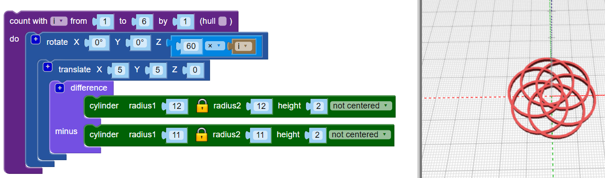

## Add more hoops

The design uses six intersecting hoops, and each hoop is moved out from the centre and rotated a different number of degrees.

--- task ---

In the final design, there is no central hoop: the hoops are all moved out from the centre.

First, `translate`{:class="blockscadtransforms"} (move) the first hoop into position.

Now the hoop is a little off-centre.

--- /task --- --- task ---

You need multiple copies of this hoop, rotated around the centre. First, create three equally spaced hoops:

Πρόσθεσε έναν βρόχο `count`{:class="blockscadloops"} (μέτρηση) για τη δημιουργία τριών κρίκων. Για να διαχωρίσεις τους κρίκους, βάλε μια εντολή περιστροφής `rotate`{:class="blockscadtransforms"} μεταξύ του βρόχου `count` και της μετακίνησης (`translate`). Η `count` ορίζει τη μεταβλητή `i` από 1 έως 3. Η `rotate` περιστρέφει κάθε κρίκο κατά `120 × i` μοίρες, έτσι ώστε και οι τρεις κρίκοι να κατανέμονται εξίσου στις 360 μοίρες ενός κύκλου (360/3 = 120).

Δες τον κώδικα και βεβαιώσου ότι καταλαβαίνεις πώς λειτουργεί.

--- /task --- --- task ---

Ο τελικός σχεδιασμός έχει έξι κρίκους αντί για τρεις. Άλλαξε τον κώδικά σου έτσι ώστε να δημιουργεί έξι κρίκους.

--- hints --- --- hint ---

Άλλαξε τον βρόχο `count`{:class="blockscadloops"} έτσι ώστε να εκτελείται έξι φορές αντί για τρεις. Οι έξι κρίκοι θα πρέπει να κατανεμηθούν ισόποσα στις 360 μοίρες.

--- /hint --- --- hint ---

Πρέπει να αλλάξεις τον βρόχο για να τρέξει από 1 σε 6 και να μετακινηθεί σε πολλαπλάσια των 60 μοιρών (360 / 6 = 60):

--- /hint --- --- hint ---

Ο κώδικάς σου θα πρέπει να μοιάζει κάπως έτσι:

--- /hint --- --- /hints --- --- /task ---	
	
