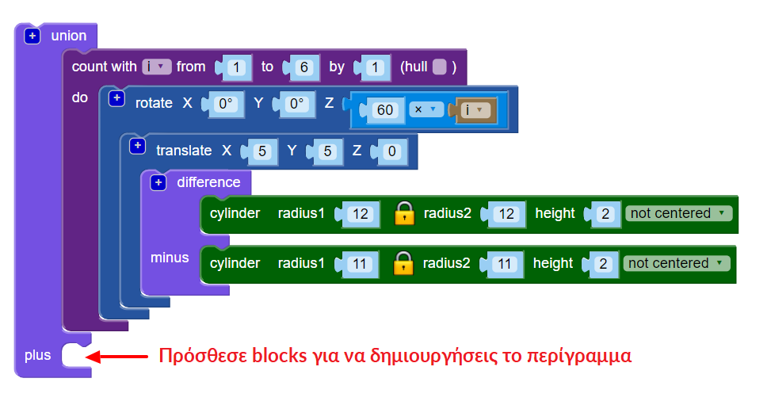

## Βάλε περίγραμμα

Στη συνέχεια, βάλε ένα περίγραμμα γύρω από την άκρη του σχεδίου.

--- task ---

Δημιούργησε ένα κεντραρισμένο κρίκο που αγγίζει τις άκρες του σχεδίου. Μπορείς είτε να κάνεις τις μαθηματικές πράξεις για να υπολογίσεις ποια πρέπει να είναι η ακτίνα του κύκλου, είτε μπορείς απλά να δημιουργήσεις έναν κύκλο και να αλλάξεις την ακτίνα του μέχρι να δουλεύει. Και οι δύο προσεγγίσεις είναι εντάξει!

Χρησιμοποίησε την ένωση `union`{:class="blockscadsetops"} για να ενώσεις το περίγραμμα με τα άλλα στεφάνια:

--- hints ---
 --- hint ---

Χρησιμοποίησε τον κύλινδρο `cylinder` και τη διαφορά `difference` για να φτιάξεις τον κρίκο.

Καθένας από τους έξι κρίκους έχει ακτίνα 12 mm, οπότε ο κύλινδρος του περιγράμματος θα πρέπει να είναι μεγαλύτερος από αυτόν. Θα μπορούσες να δοκιμάσεις να ρυθμίσεις την ακτίνα στα 24 mm.

Για να δημιουργήσεις έναν κρίκο, η ακτίνα του δεύτερου κυλίνδρου `cylinder` στην εντολή `difference` πρέπει να είναι 1 mm μικρότερη από την ακτίνα του πρώτου `cylinder`.

--- /hint --- --- hint ---

Ρύθμισε το μέγεθος των κυλίνδρων `cylinder` έως ότου ο μεγάλος κρίκος αγγίζει τα εξωτερικά άκρα των έξι εσωτερικών κρίκων.

--- /hint --- --- hint ---

Η ακτίνα πρέπει να είναι περίπου `20`. (Στην εισαγωγή, είπαμε ότι το τελικό μενταγιόν θα έχει διάμετρο 40 mm!)

Θα μπορούσες επίσης να χρησιμοποιήσεις μαθηματικά για να υπολογίσεις τη διάμετρο.

Η διάμετρος κάθε εσωτερικού κρίκου είναι 24 mm. Εάν οι κρίκοι συναντηθούν στο κέντρο του μενταγιόν, τότε το μεγάλο στεφάνι θα πρέπει να έχει ακτίνα 24 mm. Αλλά οι εσωτερικοί κρίκοι αλληλοεπικαλύπτονται, επειδή μετακινούνται κατά 5 mm κατά μήκος των αξόνων Χ και Υ.

Αυτό αφαιρεί ένα τμήμα από την ακτίνα. Αυτό το κομμάτι βρίσκεται στο τόξο, 5mm από την αρχή, οπότε γνωρίζουμε ότι πρέπει να αφαιρέσουμε 5mm από τα 24mm. Αυτό σημαίνει ότι η εσωτερική ακτίνα του μεγάλου κρίκου πρέπει να είναι 19 mm.

Τα μαθηματικά είναι πραγματικά χρήσιμα όταν πρέπει να είσαι ακριβής. Αλλά είναι εντάξει κι αν παίξεις με τις τιμές μέχρι να πάρεις το αποτέλεσμα που θες.

--- /hint ------ /hints --- --- /task ---
