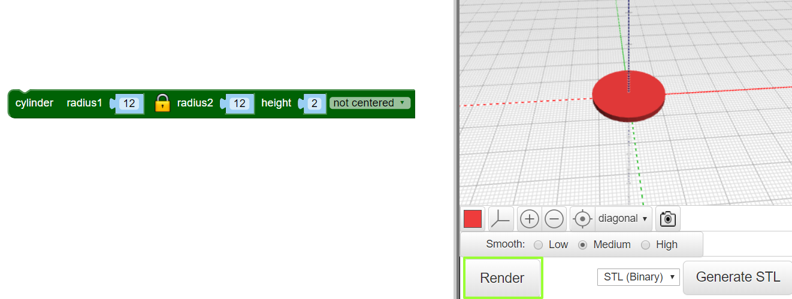

## Create a hoop

The design uses 6 interlocking hoops in the centre  and  a larger hoop around the outside. The pendant is 4cm across plus the hoop for hanging. It’s 2mm deep so it will 3D print quite quickly.

First you're going to make a single inner hoop. 

+ Open the BlocksCAD editor in a web browser [blockscad3d.com/editor/](https://www.blockscad3d.com/editor/){:target="_blank"}.

You can drag and drop blocks to write code to create 3D objects. 

+ Create a cylinder with a radius of 12mm. 

	 
	
	Cylinders are automatically centred along the x and y axes. Choosing 'not centred' means that the pendant will sit on the 'surface' which is what we want. 
	
	Click 'Render' after each change to your code to see the results. 
	
+ Now use `difference` to remove a smaller cylinder from the centre to just leave a hoop around the edge:

	 
	
	If you like, you can change the colour used in the viewer. Remember this won't affect the colour of your 3D print, that will depend on the filament you use. 
	

	
	