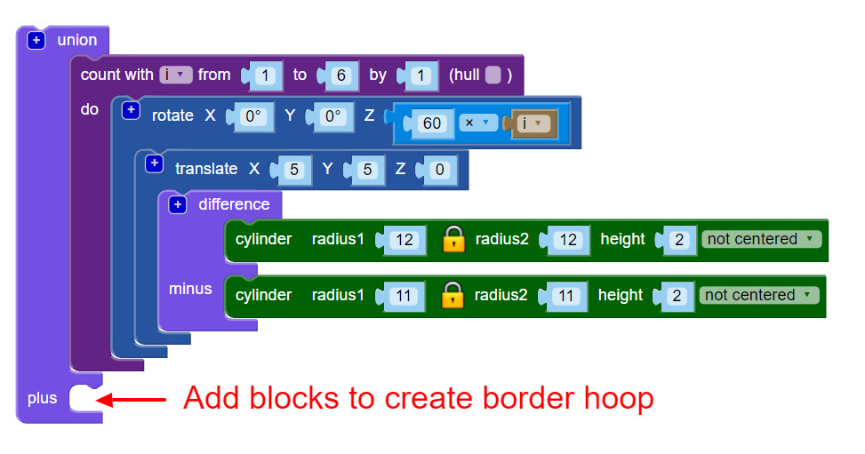

## Add a border

Now let’s add a border around the edge of the hoop design. 

 

--- task ---
Create a centred hoop that touches the edges of the inner circle. You can either work out what the radius of the circle needs to be using maths, or you can just create a circle and change the radius until it works. Either approach is fine!

Use the `union`{:class="blockscadsetops"} block to join the border to the other hoops:
	
 

--- hints --- 
--- hint ---
First try making a hoop using the cylinder and difference blocks. 

The 6 hoops have a radius of 12mm so the border cylinder will be bigger than that. You could try 24mm. 

The radius of the second cylinder in the difference block will need to be 1mm less than the radius of the first cylinder to leave a hoop. 
--- /hint ---
--- hint ---
Adjust the size of the cylinders until the hoop just touches the outer edges of the 6 hoops. 
--- /hint ---
--- hint ---
A radius of about 20mm is about right. (Did you notice that the introduction to this project says that the finished pendant will be 40mm in diameter!)

	
You could have used maths to work out the diameter. 

The diameter of the inner circles is 24mm. If the circles met at the centre then the border would need to have a radius of 24mm. But the inner circles overlap because they are translated 5mm in the x and y directions. 

This removes a section from the radius we need. This section is actually on the arc 5mm from the origin so we know we need to remove 5mm from 24mm to give us 19mm. This means that the inner radius of the border should be 19mm. 

Maths is really useful when you need to be accurate. But it's fine to just change things until you get the result you need. 

--- /hint ---
--- /hints --- 
--- /task ---
