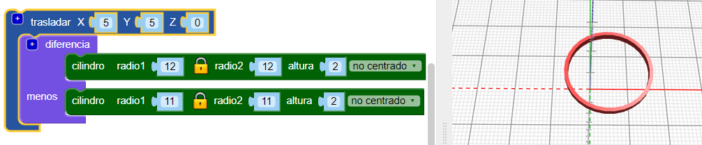
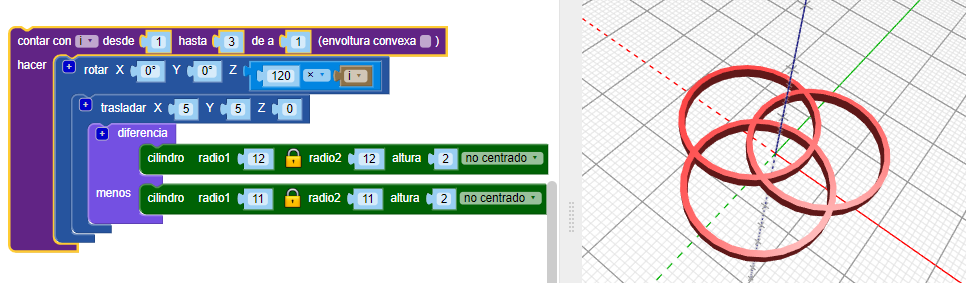
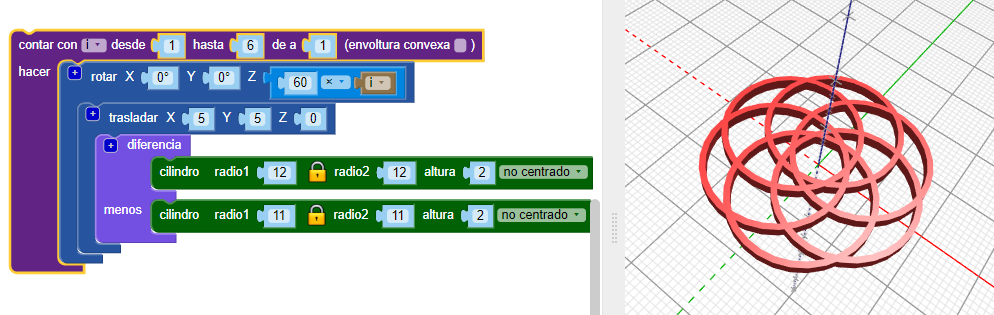

## Añade más aros

El diseño usa seis aros entrelazados y cada uno se mueve desde el centro y gira un número diferente de grados.

--- task ---

En el diseño final, no hay un aro central: todos se alejan del centro.

Primero, usa el bloque `trasladar`{:class="blockscadtransforms"} para mover el primer aro a su posición.

Ahora el aro está un poco fuera del centro.

--- /task --- --- task ---

Necesitas varias copias de este aro, giradas alrededor del centro. Lo primero, crea tres aros igualmente espaciados:

Añade un bucle `contar`{:class="blockscadloops"} para crear tres aros. Para espaciar los aros, añade un bloque `rotar`{:class="blockscadtransforms"} entre el bucle `contar` y el bloque `trasladar`. `Contar` establece el valor de la variable `i` desde 1 a 3. `Rotar` gira cada aro `120` grados, de esta forma los tres aros están distribuidos por igual alrededor de los 360 grados de un círculo (360/3 = 120).

Mira el código y asegúrate de entender cómo funciona.

--- /task --- --- task ---

El diseño acabado tiene seis aros en lugar de tres. Cambia tu código para que crear seis aros igualmente espaciados.

--- hints ---
 --- hint ---

Cambia el bucle `contar`{:class="blockscadloops"} para que funcione seis veces en lugar de tres. Los seis aros tendrán que estar distribuidos por igual a lo largo de los 360 grados.

--- /hint --- --- hint ---

Vas a necesitar cambiar el bucle para que recorra los números desde el 1 al 6 y gire en múltiplos de 60 grados (360 / 6 = 60):

--- /hint --- --- hint ---

Tu código debe parecerse a esto:

--- /hint ------ /hints --- --- /task ---	
	
