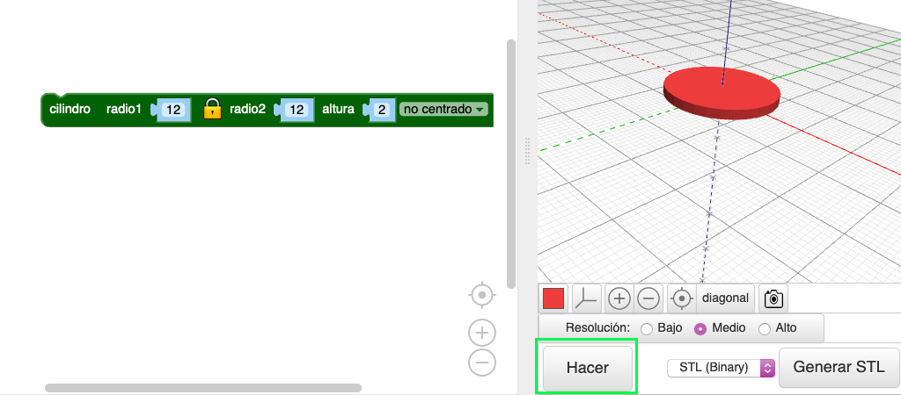
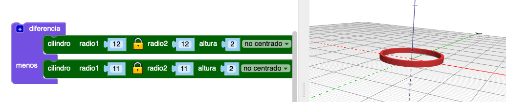

## Crea un aro

El diseño utiliza seis aros entrelazados en el centro y un aro más grande rodeando el exterior. El colgante tiene un diámetro de 40 mm, más el aro para colgar. Es de 2mm de espesor, por lo que se imprimirá en 3D bastante rápidamente.

En primer lugar, haremos un aro interior.

--- task ---

Abre el editor BlocksCAD en un navegador web [blockscad3d.com/editor/](https://www.blockscad3d.com/editor/){:target="_blank"}.

Puedes arrastrar y soltar bloques para escribir código que cree objetos en 3D.

--- /task --- --- task ---

Crea un `cilindro` con un radio de `12` y una altura de `2` (las unidades aquí son milímetros).

Los `cilindros` se centran automáticamente a lo largo de los ejes X e Y. Selecciona `no centrado` para que el colgante se asiente en la superficie. (Esto significa que el valor del eje Z es mayor que 0).

Haz clic en el botón **Hacer** después de cada cambio en tu código para ver los resultados.

--- /task --- --- task ---

Ahora, usa `diferencia`{:class="blockscadsetops"} para eliminar el `cilindro más pequeño` del centro. Esto crea un aro:

Si quieres, puede hacer clic en el cuadrado coloreado para cambiar el color utilizado en el visor. Esto no afecta al color de tu colgante, ya que dependerá del color del filamento que utilices para imprimir.

--- /task ---
	
	
