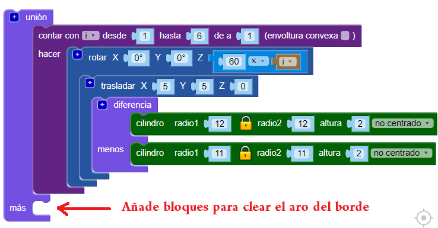
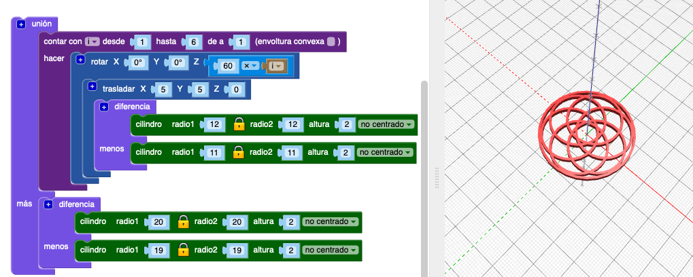

## Añade un borde

A continuación, añade un borde alrededor de la parte exterior del diseño.

--- task ---

Crea un aro centrado que toque los bordes del diseño. Puede hacer los cálculos para determinar cuál debe ser el radio del círculo, o simplemente puedes crear un círculo y cambiar el radio hasta que funcione. ¡Cualquiera de los dos enfoques está bien!

Usa el bloque `unión`{:class="blockscadsetops"} para unir el borde con los otros aros:

--- hints ---
 --- hint ---

Usa los bloques `cilindro` y `diferencia` para hacer el aro.

Cada uno de los seis aros tiene un radio de 12 mm, por lo que el cilindro del borde que estás haciendo debe ser más grande que eso. Puedes intentar ajustar el radio a 24 mm.

Para hacer un aro, el radio del segundo `cilindro` en el bloque `diferencia` debe ser 1 mm más pequeño que el radio del primer `cilindro`.

--- /hint --- --- hint ---

Ajusta el tamaño de los `cilindros` hasta que el aro del borde toque los bordes exteriores de los seis aros interiores.

--- /hint --- --- hint ---

El radio debe estar alrededor de `20`. (¡En la introducción, se decía que el colgante terminado tendría 40 mm de diámetro!)

También podrías usar las matemáticas para calcular el diámetro.

El diámetro de cada aro interior es de 24 mm. Si los aros se unen en el centro del colgante, entonces el aro del borde debería tener un radio de 24 mm. Pero los aros interiores se superponen, ya que se trasladan 5 mm a lo largo de los ejes X e Y.

Esto elimina una sección del radio. Esta sección está en el arco, a 5 mm del origen, por lo que sabemos que necesitamos eliminar 5 de los 24 mm. Esto significa que el radio interno del aro del borde debe ser de 19 mm.

Las matemáticas son realmente útiles cuando necesitas ser preciso. Pero está bien cambiar las cosas hasta que obtengas el resultado que necesitas.

--- /hint ------ /hints --- --- /task ---
