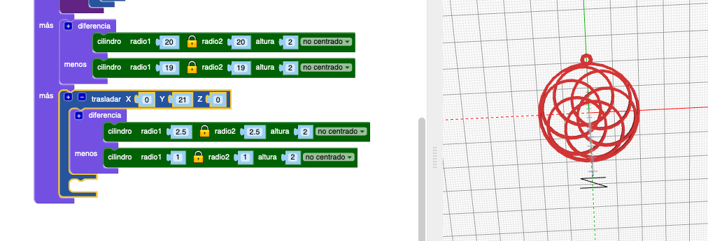
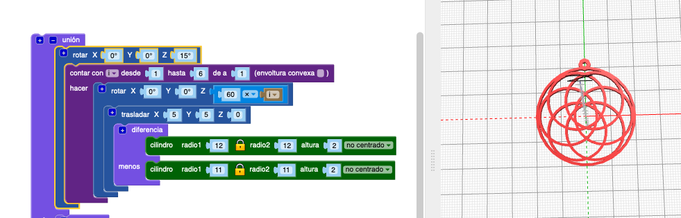

## Añade un aro para colgar

Ahora, añade un pequeño aro que hará de colgante a través del cual puedas pasar un cordón para hacer un collar.

Sugerencia: Este código añade un aro pequeño que se puede utilizar con el hilo del collar elástico. Si tienes un cordón o cadena más grande, puedes adaptar el código para crear un aro de colgante más grande.

--- task ---

Añade un aro colgante pequeño por el que puedas pasar un hilo.

Haz clic en `+` en la parte superior del bloque `unión` para añadir otra sección.

Por el momento, la posición del aro colgante no es visualmente muy agradable.

--- /task --- --- task ---

Añade un bloque `rotar`{:class="blockscadtransforms"} para mover los aros interiores de modo que el aro colgante se centre sobre uno de los huecos que hay entre ellos.

--- /task ---	

	
