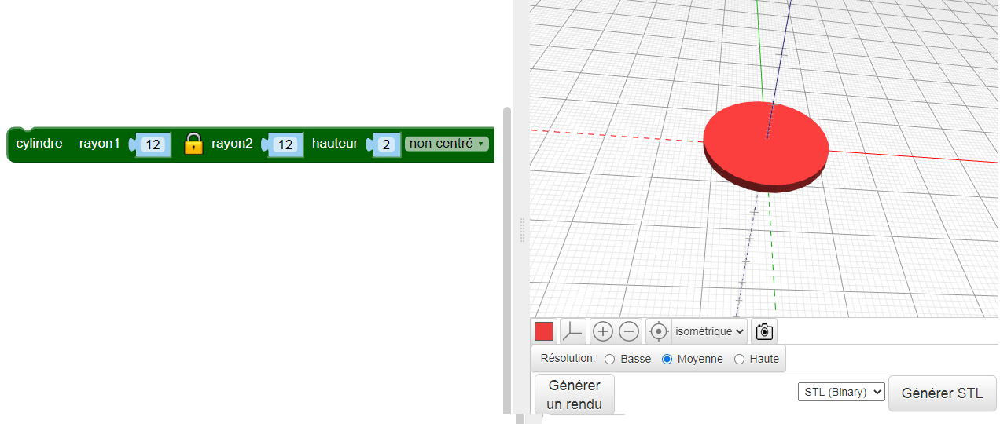
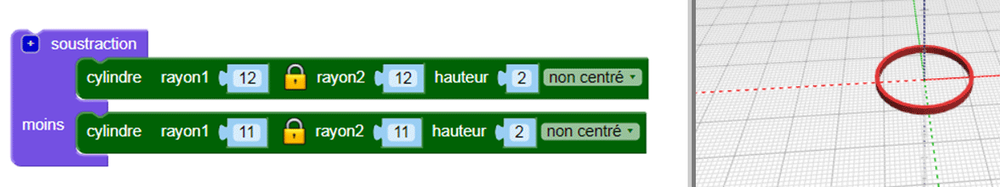

## Créer un cerceau

Le design utilise six cerceaux interconnectés au centre et un cercle plus grand autour de l'extérieur. Le pendentif a une largeur de 4 cm, plus la boucle pour accrocher. Il a une épaisseur de 2 mm, il sera donc imprimé en 3D assez rapidement.

Tout d'abord, fais un seul cerceau intérieur.

--- task ---

Ouvre l'éditeur BlocksCAD dans un navigateur web [blockscad3d.com/editor/](https://www.blockscad3d.com/editor/){:target="_blank"}.

Tu peux faire glisser et déposer des blocs pour écrire du code pour créer des objets 3D.

--- /task --- --- task ---

Crée un `cylindre` avec un rayon de `12` et une hauteur de `2` (l'unité est en millimètres).

`Les cylindres` sont automatiquement centrés le long des axes X et Y. Sélectionne `non centré` de sorte que le pendentif se trouve sur la surface. (Cela signifie que la valeur de l'axe Z est plus grande que 0).

Clique sur le bouton **Générer un rendu** après chaque modification de ton code pour voir les résultats.

--- /task --- --- task ---

Maintenant, utilise `soustraction`{:class="blockscadsetops"} pour enlever un plus petit `cylindre` du centre. Cela crée un cerceau :

Si tu le souhaites, tu peux cliquer sur le carré coloré pour changer la couleur utilisée dans la visionneuse. Cela n'affecte pas la couleur de ton pendentif, car cela dépend de la couleur du filament que tu utilises.

--- /task ---
	
	
