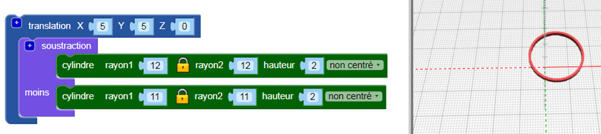
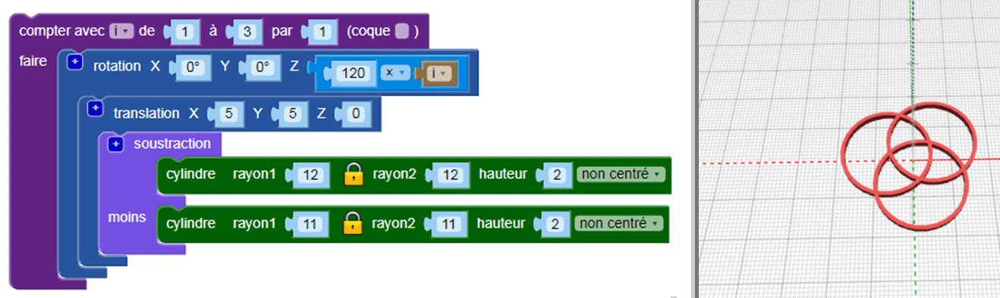
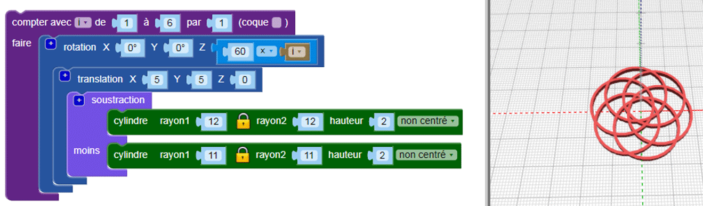

## Ajouter plus de cerceaux

Le design utilise six cerceaux entrecroisés, et chaque cerceau est déplacé du centre et pivoté d'un nombre différent de degrés.

--- task ---

Dans le design final, il n'y a pas de cerceaux centraux: les cerceaux sont tous déplacés du centre.

D'abord, `translation`{:class="blockscadtransforms"} (déplace) le premier cerceau en position.

Maintenant le cerceau est un peu excentré.

--- /task --- --- task ---

Tu as besoin de plusieurs copies de ce cerceau, tourné autour du centre. Tout d'abord, crée trois cerceaux à espacement égal :

Ajoute une boucle `compter`{:class="blockscadloops"} pour créer trois cerceaux. Pour espacer les cerceaux, ajoute un bloc `rotation`{:class="blockscadtransforms"} entre la boucle `compter` et le bloc `translation`. `Compter` définit la variable `i` de 1 à 3. `Rotation` déplace chaque cerceau de `120 × i `degrés, de sorte que les trois cerceaux sont répartis également autour des 360 degrés d'un cercle (360/3 = 120).

Regarde le code et assure-toi de comprendre comment il fonctionne.

--- /task --- --- task ---

Le design fini a six cerceaux au lieu de trois. Modifie ton code pour qu'il crée six cercles espacés de manière égale.

--- hints --- --- hint ---

Change la boucle `compter`{:class="blockscadloops"} pour qu'elle s'exécute six fois au lieu de trois. Les six cerceaux devront être également être espacés de manière égale autour de 360 degrés.

--- /hint --- --- hint ---

Tu dois changer la boucle pour qu'elle passe de 1 à 6 et se déplacer par multiples de 60 degrés (360/6 = 60) :

--- /hint --- --- hint ---

Ton code devrait ressembler à ceci :

--- /hint --- --- /hints --- --- /task ---	
	
