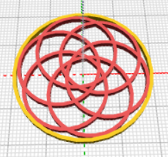
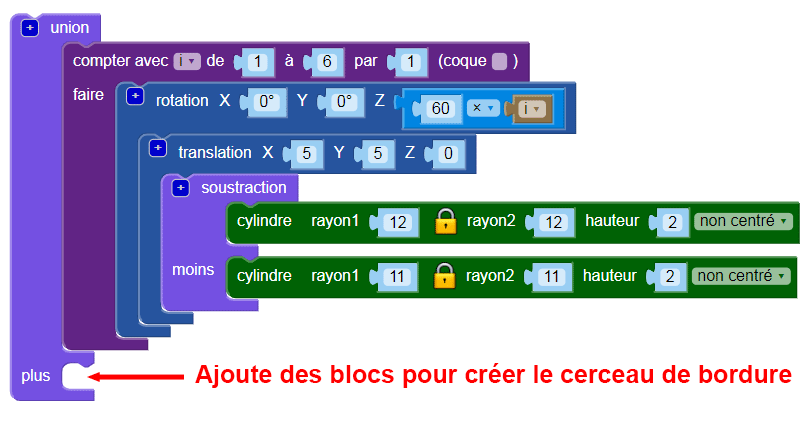
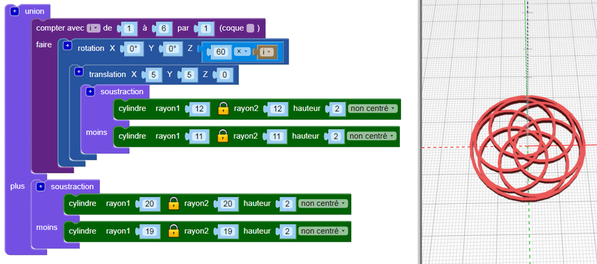

## Ajouter une bordure

Ensuite, ajoute une bordure autour du bord du dessin.

--- task ---

Crée un cerceau centré qui touche les bords du design. Tu peux soit faire le calcul pour déterminer le rayon du cercle, soit créer un cercle et modifier le rayon jusqu'à ce qu'il fonctionne. L'une ou l'autre approche est bonne !

Utilise le bloc `union`{:class="blockscadsetops"} pour relier la bordure aux autres cerceaux :

--- hints --- --- hint ---

Utilise les blocs `cylindres` et `soustraction` pour faire le cerceau.

Les six cerceaux ont chacun un rayon de 12 mm, donc le cylindre de bordure que tu fais doit être plus grand que cela. Tu peux essayer de régler le rayon à 24 mm.

Pour faire un cerceau, le rayon du second `cylindre` dans le bloc `soustraction` doit être inférieur de 1 mm au rayon du premier `cylindre`.

--- /hint --- --- hint ---

Ajuste la taille des `cylindres` jusqu'à ce que le cerceau de bordure touche simplement les bords extérieurs des six cerceaux intérieurs.

--- /hint --- --- hint ---

Le rayon devrait être autour de `20`. (Dans l'introduction, il est dit que le pendentif fini aura un diamètre de 40 mm !)

Tu peux également utiliser les mathématiques pour déterminer le diamètre.

Le diamètre de chaque cerceau intérieur est de 24 mm. Si les cerceaux se sont rencontrés au centre du cercle, alors le cerceau de la bordure devrait avoir un rayon de 24 mm. Mais les cerceaux intérieurs se chevauchent, parce qu'ils sont translatés de 5 mm le long des axes X et Y.

Cela supprime une section du rayon. Cette section est sur l'arc, 5 mm de l'origine, nous savons donc que nous devons enlever 5 mm de 24 mm. Cela signifie que le rayon intérieur du cerceau de bordure devrait être de 19 mm.

Les mathématiques sont vraiment utiles lorsque tu as besoin d'être précis. Mais il est bon de simplement changer les choses jusqu'à ce que tu obtiennes le résultat dont tu as besoin.

--- /hint --- --- /hints --- --- /task ---
