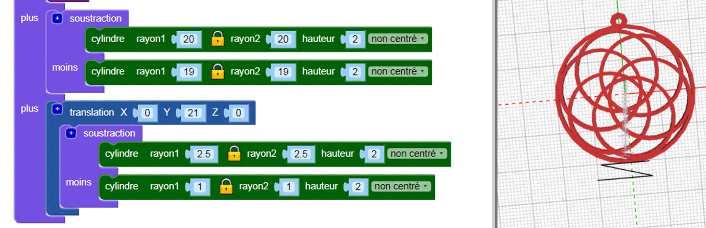
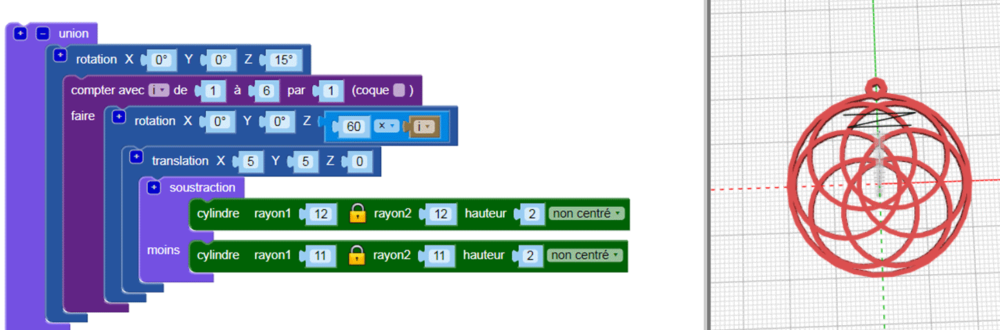

## Ajouter une attache

Maintenant, ajoute une petite attache à travers lequel tu peux filer une corde pour faire un collier.

Astuce : Ce code ajoute un petit cerceau qui peut être utilisé avec un fil de collier élastique. Si tu as un cordon ou une chaîne plus grande, tu peux adapter le code pour créer une attache plus grande.

--- task ---

Ajoute une petite attache dans laquelle tu peux passer un fil.

Clique sur le `[+]` sur le bloc `union` pour ajouter une autre section.

Pour le moment, la position de l'attache n'est pas très agréable visuellement.

--- /task --- --- task ---

Ajoute un bloc `rotation`{:class="blockscadtransforms"} pour déplacer les cerceaux intérieurs afin que l'attache soit centrée sur l'un des écarts entre eux.

--- /task ---	

	
