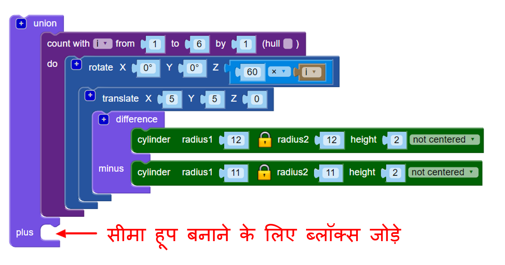
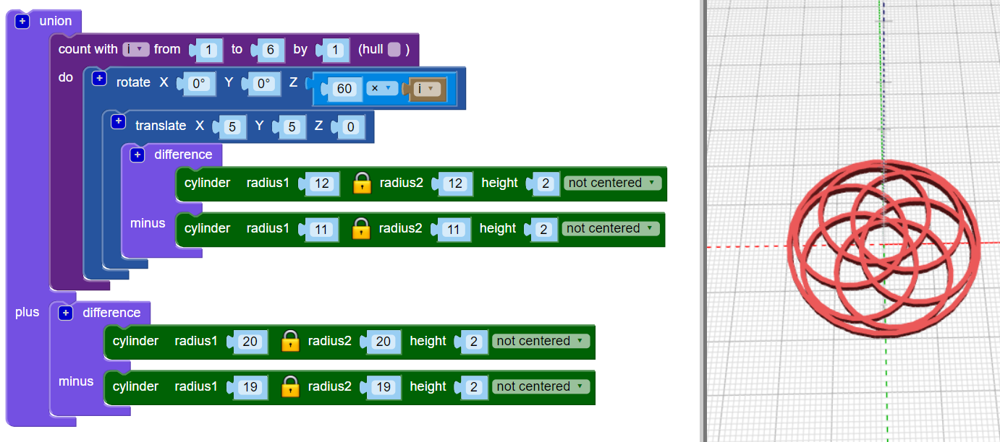

## एक सीमा जोड़ें

अगला, डिज़ाइन के किनारे के चारों ओर एक सीमा जोड़ें।

--- task ---

एक केंद्रित घेरा बनाएं जो डिज़ाइन के किनारों को छूता है। आप या तो गणित का उपयोग कर के रेडियस को खोज सकते है, या फिर एक नया सर्किल बनाके उसका रेडियस को तब तक बदल सकते हैं जब तक कि वह सीमा की तरह न दिखें। दोनों में से कोई भी आप प्रयोग कर सकते है!

`union`{:class="blockcadsetops"} ब्लॉक का उपयोग करके आप आकृतियों को एक साथ जोड़ सकते हैं:

--- hints ---

 --- hint ---

घेरा बनाने के लिए `cylinder` और `difference` ब्लॉकों का उपयोग करें।

छह घेरे में प्रत्येक का रेडियस 12mm है, इसलिए सीमा सिलेंडर जो आप बना रहे हैं, उससे बड़ा होना चाहिए। आप रेडियस को 24mm तक सेट करके प्रयास कर सकते हैं।

एक घेरा बनाने के लिए, `difference` ब्लॉक के दूसरे `cylinder` का रेडियस, पहले `cylinder` के रेडियस से 1mm से छोटा होना चाहिए।

--- /hint --- --- hint ---

`cylinders` के आकार को बदलें जब तक कि सीमा घेरा सिर्फ छह आंतरिक घेरे के बाहरी किनारों को छूता है।

--- /hint --- --- hint ---

रेडियस लगभग `20` होना चाहिए। (परिचय में, यह कहा गया कि तैयार झुमका व्यास में 40 मिमी होगी!)

व्यास का काम करने के लिए आप गणित का भी उपयोग कर सकते हैं।

प्रत्येक आंतरिक घेरा का व्यास 24mm है। यदि घेरा, झुमका के केंद्र में मिलता है, तो सीमा घेरा को 24mm की रेडियस की आवश्यकता होगी। लेकिन आंतरिक घेरे ओवरलैप करते हैं, क्योंकि उन्हें x और y अक्षों के साथ 5mm से खिसकाया गया है।

यह रेडियस से एक खंड निकालता है। यह खंड आर्क पर है, मूल से 5mm, इसलिए हम जानते हैं कि हमें 24mm से 5mm निकालने की आवश्यकता है। इसका मतलब है कि सीमा घेरा का आंतरिक रेडियस 19mm होना चाहिए।

गणित वास्तव में उपयोगी है जब आपको सटीक होने की आवश्यकता होती है। लेकिन जब तक आपको अपनी जरूरत का परिणाम न मिले तब तक चीजों को बदलना ठीक है।

--- /hint ------ /hints --- --- /task ---
