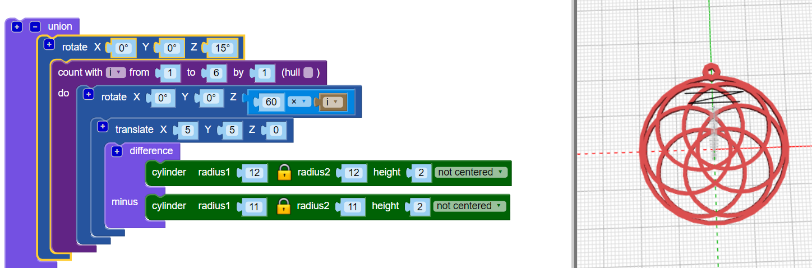

## एक लटका हुआ घेरा जोड़ें

अब, एक छोटा सा लटका हुआ घेरा जोड़ें, जिसके माध्यम से आप एक हार बनाने के लिए धागा जोड़ सकते हैं।

Tip: यह कोड एक छोटा घेरा जोड़ता है जिसका उपयोग लोचदार माला धागे के साथ किया जा सकता है। यदि आपके पास एक बड़ा कॉर्ड या चेन है, तो आप कोड को बड़े हैंगिंग हूप बनाने के लिए अनुकूलित कर सकते हैं।

--- task ---

एक छोटा लटका हुआ घेरा जोड़ें जिसे आप एक धागा डाल सकते हैं।

किसी अन्य अनुभाग को जोड़ने के लिए `union` ब्लॉक के ऊपर `[+]` पर क्लिक करें।

फिलहाल, लटके हुए घेरे की स्थिति बहुत अच्छी नहीं दिख है।

--- /task --- --- task ---

भीतरी घेरों को खिसकाने के लिए `rotate`{:class="blockscadtransforms"} ब्लॉक को जोड़ें ताकि लटका हुआ घेरा उन दोनों की बीच की जगह में केंद्रित हो जाए।

--- /task ---	

	
