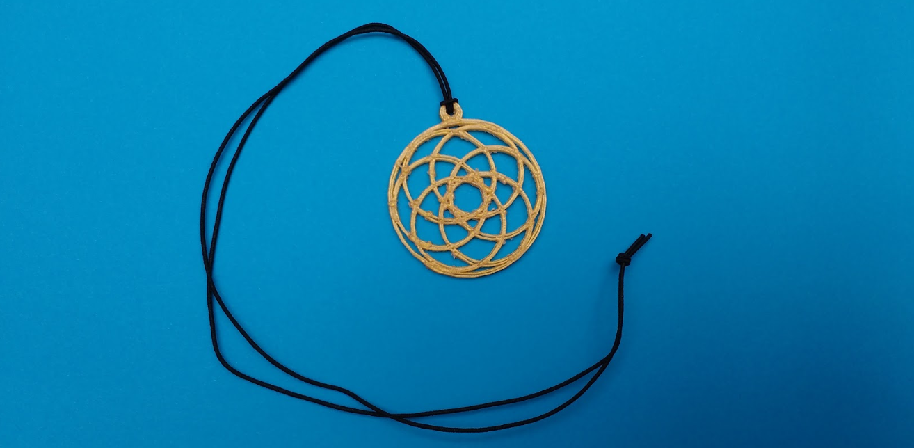

## अपने झुमके को 3D प्रिंट करें और जोड़ें

BlocksCAD 3D, 3D प्रिंटिंग के लिए `.STL` फ़ाइल निर्यात कर सकता है।

--- task ---

अपना मॉडल रेंडर (render) करें और फिर **Generate STL** पर क्लिक करें। याद रखें कि आप STL file को कहाँ save करते हैं।

--- /task --- --- task ---

अपनी पसंद के रंग के एक फिलामेंट का उपयोग करके अपने झुमका को 3D प्रिंट करें।

--- /task --- --- task ---

बहुत सावधानी से प्रिंट बेड से 3 डी प्रिंट निकालें। झुमका पतला है, इसलिए यह काफी नाजुक है।

--- /task --- --- task ---

आपको प्रिंट को साफ करने के लिए फिलामेंट (विशेष रूप से लटके घेरे से) के छोटे किस्में निकालने की आवश्यकता हो सकती है।

--- /task --- --- task ---

एक श्रृंखला या कॉर्ड को झुमके से जोड़ें। यदि आप एक मोटी रस्सी या हार का उपयोग करना चाहते हैं, तो आप डिजाइन को बड़ा लटका हुआ घेरे के अनुसार समायोजित कर सकते हैं।

--- /task ---

***

समुदाय के योगदान से किया गया अनुवाद

इस परियोजना का अनुवाद राहुल सिन्हा ने किया है और समीक्षा वसुंधरा द्वारा कि गयी  है।

हमारे अद्भुत अनुवाद स्वयंसेवक हमारी मदद करते है ताकि हम दुनिया भर के बच्चों को कोड करना सीखने का मौका प्रदान कर सके।. आप हमारी परियोजनाओं का अनुवाद करके और अधिक बच्चों तक पहुंचने में हमारी सहायता कर सकते हैं - [rpf.io/translate](https://rpf.io/translate) पर जाकर अधिक जानकारी हासिल करे