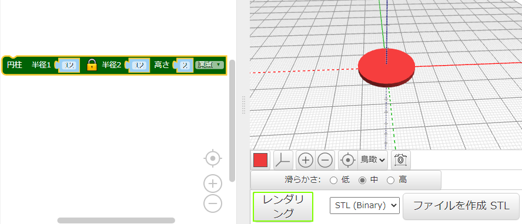
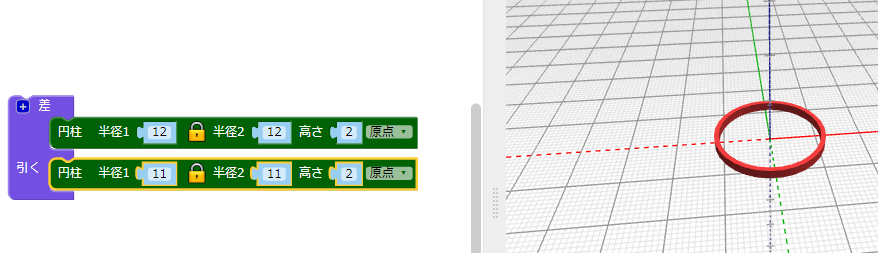

## 輪を作る

このデザインでは、中央で重なり合った6つの輪と、外がわに大きな輪を使用しています。 ペンダントトップの幅 (はば) は4cm (つり下げ用の輪をのぞく) です。 厚さ (あつさ) は2mmなので、3Dプリントもすぐにおわります。

まず、内がわの輪を1つ作ります。

--- task ---

ウェブブラウザでBlocksCADエディターを開きます。 [blockscad3d.com/editor/](https://www.blockscad3d.com/editor/){:target="_blank"}

ブロックをドラッグ&ドロップして、3Dオブジェクトを作成するコードを書くことができます。

--- /task --- --- task ---

半径`12`、高さ`2`の`円柱`を作成します (ここでの単位はミリメートルです)。

`円柱`は X軸 (じく) とY軸にそって自動的に中央に配置 (はいち) されます。 `原点`をえらんでペンダントトップが表面に配置されるようにします。 （これは、Z軸の値 (あたい) が0より大きいことを意味します）。

コードをかえるたびに**レンダリング**ボタンをクリックして結果を見ましょう。

--- /task --- --- task ---

次に、`差`{:class="blockscadsetops"} (さ) を使用して、中央から小さい`円柱`を取りのぞきます。 これで輪ができます。

色のついた四角い部分をクリックすると、ビューアで使用する色をかえることもできます。 ここで色をかえても、実物のペンダントトップの色はかわりません。ペンダントトップの色は使用するフィラメントの色で決まるからです。

--- /task ---
	
	
