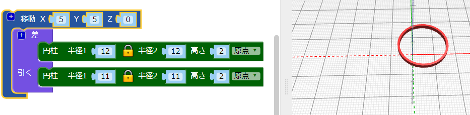
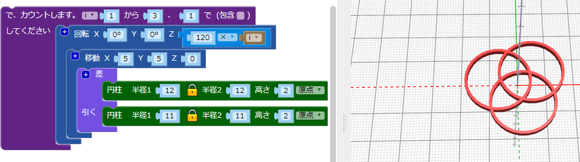
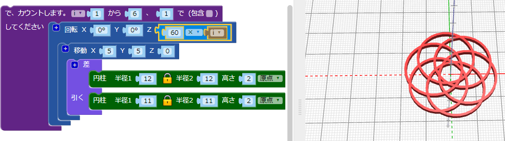

## もっと輪を作る

このデザインでは、6つの交差する輪を使用し、それぞれの輪は中心から外に移動してちがう角度で回転します。

--- task ---

最終的 (さいしゅうてき) なデザインでは、中央には輪はありません。輪はすべて中心から移動 (いどう) します。

まず、はじめに作った輪を`移動`{:class="blockscadtransforms"} (動か)します。

これで輪は少し中心からはずれました。

--- /task --- --- task ---

この輪を中心のまわりに回転させてコピーします。 まず、3つの輪を同じ間隔 (かんかく) で作成します。

`カウント`{:class="blockscadloops"}ループを追加 (ついか) して、3つの輪を作成します。 輪の間隔をあけるには、`カウント`ループと`移動`ブロックの間に`回転`{:class = "blockscadtransforms"}ブロックを追加します。 `カウント`は、`i`変数 (へんすう) を1から3に設定します。 `回転`は `120 × i`度だけそれぞれの輪を移動させます。つまり、3つの輪は円の360度の周りに等しく配置されます(360÷3=120)。

コードを見て、その仕組みをりかいしましょう。

--- /task --- --- task ---

最終的なデザインには3つではなく6つの輪があります。 同じ間隔の6つのフープを作成するようにコードをかえます。

--- hints --- --- hint ---

`カウント`{:class="blockscadloops"}ループを3回ではなく6回実行するようにかえます。 6つのフープは、360度で同じ間隔で配置する必要があります。

--- /hint --- --- hint ---

ループが1から6の間実行され、60度（360÷6 = 60）の倍数ずつ移動するようにかえる必要が あります。

--- /hint --- --- hint ---

コードは次のようになります。

--- /hint --- --- /hints --- --- /task ---	
	
