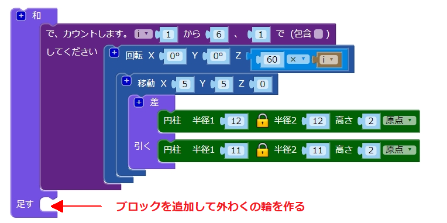
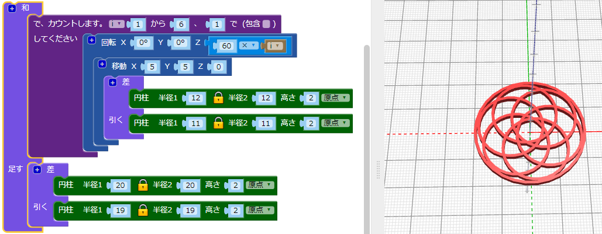

## 外わくを作る

次に、デザインのはしの周りに外わくを追加します。

--- task ---

デザインのはしにせっする、中心原点となる輪を作成します。 円の半径を計算することもできますし、円を作成して半径をかえることもできます。 どちらの方法でも構いません。

`和`{:class="blockscadsetops"}ブロックを使用して、外わくと他の輪をくっつけます。

--- hints --- --- hint ---

`円柱`と`差`ブロックを使用して、輪を作ります。

6つの輪はそれぞれ半径が12mmなので、作っている外わくの円柱は6つの輪よりも大きくなければなりません。 半径を24mmにしてみてください。

輪を作成するには、`差`ブロックの2番目の`円柱`の半径は、はじめの`円柱` の半径より1mm小さくなければなりません。

--- /hint --- --- hint ---

6つの輪のはしが外わくにちょうど接触 (せっしょく) まで`円柱`のサイズを調整します。

--- /hint --- --- hint ---

半径はおよそ`20`になるはずです。 （「はじめに」では、完成したペンダントは直径40mmになると言ってました。)

直径を計算することもできます。

内がわの輪の直径は24mmです。 輪がペンダントの中央で接触する場合、外わくの輪は24mmの半径である必要があります。 しかし、内がわの輪はX軸とY軸にそって5mm移動しているので重なり合っています。

なので、その分だけ半径が小さくなります。 それは、原点から5mmずれた円弧 (えんこ) 上にあるため、24mmから5mmを差し引く必要があることがわかります。 これは、外わくの輪の内がわ半径が19mmであることを意味します。

正確 (せいかく) さが必要なとき、数学は本当に役に立ちます。 しかし、必要な結果が出るまでかえていくだけでもかまいません。

--- /hint --- --- /hints --- --- /task ---
