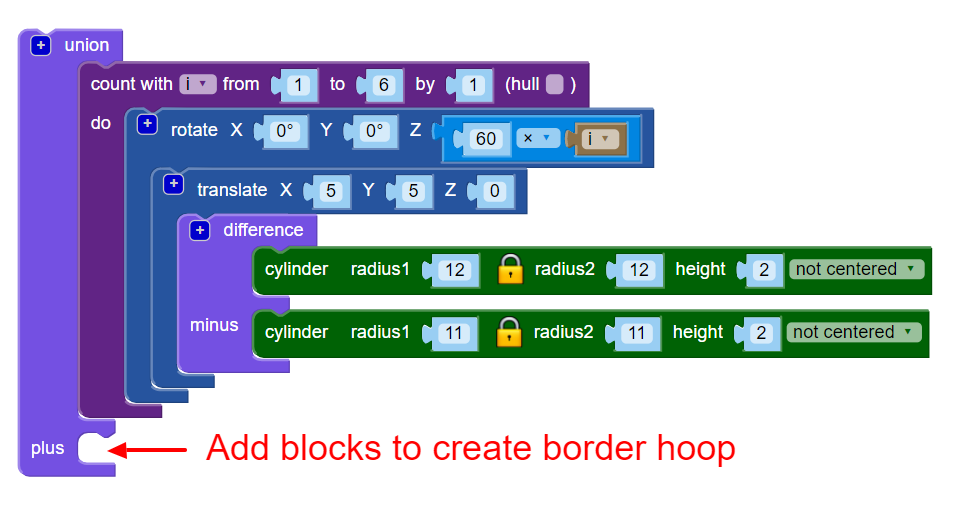

## 테두리 추가하기

다음으로 디자인의 가장자리를 따라 테두리를 추가합니다.

--- task ---

디자인의 가장자리에 닿는 중앙 고리를 만듭니다. 원의 반지름이 무엇인지 계산하기 위해 수학 개념을 사용하거나 일단 원을 만들고 적당해질 때까지 반지름을 키울 수 있습니다.  어느 쪽이든 괜찮습니다!

`union`{:class="blockscadsetops"} 블록을 사용하여 다른 고리와 결합합니다:

--- hints ---
 --- hint ---

`cylinder`와 `difference` 블록을 사용하여 고리를 만듭니다.

6개의 후프의 반지름은 각각 12mm이므로 만들고 있는 테두리는 그보다 커야 합니다. 반경을 24mm로 설정해보세요.

고리를 만들기 위해서는 `difference` 블록의 두 번째 `cylinder`의 반지름이 첫번째 `cylinder`의 반지름에 비해 1mm 더 작아야 합니다.

--- /hint --- --- hint ---

안쪽 여섯 개의 고리의 경계에 겨우 닿도록 `cylinder`의 크기를 조정합니다.

--- /hint --- --- hint ---

반지름은 약 `20`이어야 합니다. (소개에서 완성된 펜던트는 직경 40mm가 될 것이라고 했었죠?)

수학을 사용하여 지름을 계산할 수도 있습니다.

각 내부 고리의 직경은 24mm입니다. 고리가 펜던트 중앙에서 만나는 경우 테두리 후프의 반경은 24mm여야합니다. 그러나 내부 후프는 X축 및 Y축을 따라 5mm 이동했기 때문에 겹치게 됩니다.

이것은 반지름을 줄이는 효과가 있습니다. 원점에서 5mm만큼 움직였으므로, 24mm에서 5mm를 빼야 합니다. 이것은 테두리 고리의 안쪽 반지름이 19mm가 되어야 함을 의미합니다.

수학은 정확해야 할 때 정말 유용합니다. 그러나 필요한 결과를 얻을 때까지 변경하는 것도 괜찮습니다.

--- /hint --- --- /hints --- --- /task ---
