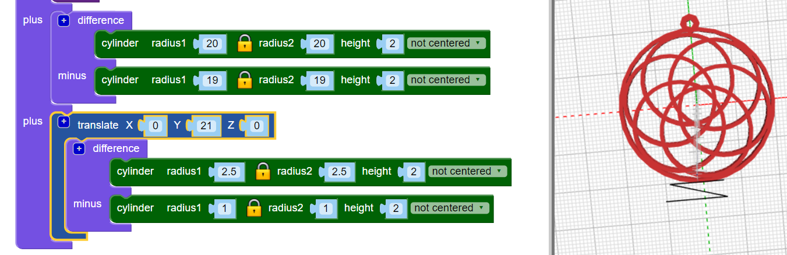

## 매다는 고리 만들기

이제 목걸이를 만들기 위해 줄에 꿰맬 수 있는 작은 고리를 추가합니다.

팁: 이 코드는 유연한 목걸이 실과 함께 사용할 수 있는 작은 고리를 추가합니다. 두께가 두꺼운 줄이나 체인을 가지고 있을 경우 코드를 바꿔 고리를 더 크게 만들 수 있습니다.

--- task ---

실을 넣을 수 있는 작은 고리를 추가합니다.

`Union` 블록의 `[+]`를 클릭하여 다른 섹션을 추가하세요.

현재 작은 고리의 위치가 시각적으로 좋아보이지는 않습니다.

--- /task --- --- task ---

매달기 위한 고리가 안쪽 고리의 여백의 중간에 오도록 `rotate`{:class="blockscadtransforms"}블록을 추가하여 안쪽 고리를 적절히 회전합니다.

--- /task ---	

	
