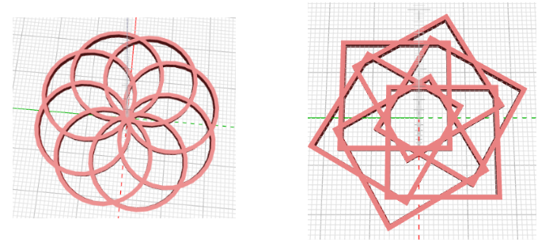

## 도전과제: 펜던트 바꾸기

--- challenge ---

이 디자인은 '생명의 꽃' 패턴의 영향을 받았습니다. 원한다면 '생명의 꽃'을 조사하고 '생명의 씨앗' 패턴을 기반으로 디자인을 만들어볼 수 있습니다.

--- /challenge ---

--- challenge ---

펜던트의 일부 값을 실험하고 변경하세요. 예를 들어, 고리의 개수 또는 회전 각도를 변경합니다.

실린더 대신 입방체(큐브)를 사용하여 패턴을 만들 수도 있습니다.

--- /challenge ---

