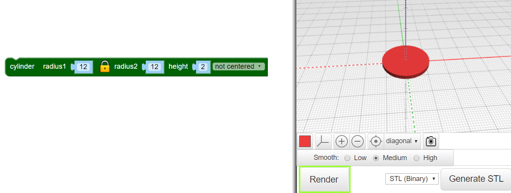
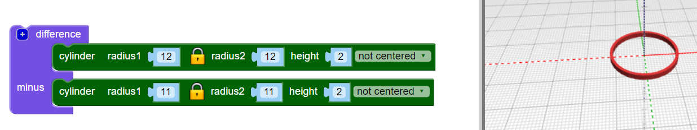

## Maak een ring

Het ontwerp maakt gebruik van zes in elkaar grijpende ringen in het midden en een grotere ring aan de buitenkant. De hanger is 4 cm breed, plus de ring om op te hangen. Het is 2 mm dik, dus het zal vrij snel 3D printen.

Maak eerst een enkele binnenring.

--- task ---

Open de BlocksCAD-editor in een webbrowser [blockscad3d.com/editor/](https://www.blockscad3d.com/editor/){:target="_blank"}.

Je kunt blokken slepen en neerzetten om code te schrijven om 3D-objecten te maken.

--- /task --- --- task ---

Maak een `cylinder` met een straal van `12` en een hoogte van `2` (de eenheid hier is millimeters).

`Cilinders` worden automatisch gecentreerd langs de X- en Y-assen. Selecteer `not centered` (niet gecentreerd) zodat de hanger op het oppervlak zit. (Dit betekent dat de waarde van de Z-as groter is dan 0).

Klik op de **Render** knop na elke wijziging in je code om de resultaten te zien.

--- /task --- --- task ---

Gebruik nu `difference`{:class="blockscadsetops"} (verschil) om een kleinere `cylinder` uit het midden te verwijderen. Dit creëert een ring:

Als je wilt, kun je op het gekleurde vierkant klikken om de kleur in de viewer te veranderen. Dit heeft geen invloed op de kleur van je hanger, want die hangt af van de kleur van het filament dat je gebruikt.

--- /task ---
	
	
