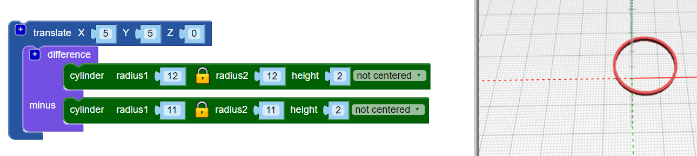

## Voeg meer ringen toe

Het ontwerp maakt gebruik van zes kruisende ringen en elke ring wordt uit het midden verplaatst en een ander aantal graden gedraaid.

--- task ---

In het uiteindelijke ontwerp is er geen centrale ring: de ringen worden allemaal uit het midden verplaatst.

`Translate`{:class="blockscadtransforms"} (verplaats) de eerste ring naar zijn plaats.

Nu is de ring een beetje uit het midden.

--- /task --- --- task ---

Je hebt meerdere exemplaren van deze ring nodig, gedraaid rond het midden. Maak eerst drie ringen op gelijke afstand van elkaar:

Voeg een `count`{:class="blockscadloops"} lus toe om drie ringen te maken. Om de ringen te verdelen, voeg een `rotate`{:class="blockscadtransforms"} blok toe tussen de `count` lus en het `translate` blok. `Count` stelt de waarde van variabele `i` in van 1 tot 3. `Rotate` verplaatst elke ring met `120 × i` graden, dus de drie ringen zijn gelijkmatig verdeeld over de 360 graden van een cirkel (360 / 3 = 120).

Kijk naar de code en zorg ervoor dat je begrijpt hoe het werkt.

--- /task --- --- task ---

Het voltooide ontwerp heeft zes ringen in plaats van drie. Wijzig je code zodat deze zes ringen met gelijke tussen-afstanden creëert.

--- hints --- --- hint ---

Wijzig de `count`{:class="blockscadloops"} lus zodat deze zes keer wordt uitgevoerd in plaats van drie. De zes ringen moeten gelijkmatig verdeeld worden over 360 graden.

--- /hint --- --- hint ---

Je moet de lus veranderen om van 1 naar 6 te lopen en in veelvouden van 60 graden te bewegen (360 / 6 = 60):

--- /hint --- --- hint ---

Je code zou er als volgt uit moeten zien:

--- /hint --- --- /hints --- --- /task ---	
	
