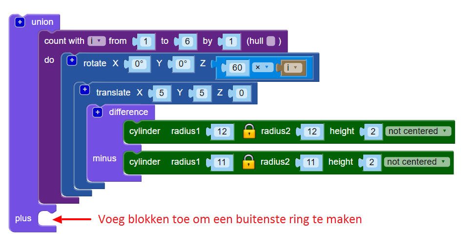

## Voeg een rand toe

Voeg vervolgens een ring toe om de rand van het ontwerp.

--- task ---

Maak een gecentreerde ring die de randen van het ontwerp raakt. Je kunt de wiskunde doen om uit te rekenen wat de straal van de cirkel moet zijn, of je kunt gewoon een cirkel maken en de straal wijzigen totdat het werkt. Beide benaderingen zijn prima!

Gebruik het `union`{:class="blockscadsetops"} blok om de rand met de andere ringen te verbinden:

--- hints --- --- hint ---

Gebruik de `cylinder` en `difference` blokken om de ring te maken.

The six hoops each have a radius of 12mm, so the border cylinder that you are making needs to be bigger than that. Je kunt proberen de straal in te stellen op 24 mm.

Om een ring te maken, moet de straal van de tweede `cylinder` in het `difference` blok 1 mm kleiner zijn dan de straal van de eerste `cylinder`.

--- /hint --- --- hint ---

Pas de grootte van de `cylinders` aan tot de ring voor de rand precies de buitenranden van de zes andere ringen raakt.

--- /hint --- --- hint ---

De straal moet ongeveer `20` zijn. (In de inleiding stond dat de voltooide hanger een diameter van 40 mm zal hebben!)

Je kunt ook wiskunde gebruiken om de diameter te berekenen.

De diameter van elke binnenring is 24 mm. Als de ringen elkaar in het midden van de hanger ontmoeten, moet de randring een straal van 24 mm hebben. Maar de binnenringen overlappen elkaar, omdat ze 5 mm langs de X- en Y-assen worden verplaatst.

Dit verwijdert een stukje uit de straal. Deze stukje bevindt zich op de boog, 5 mm van de oorsprong, dus we weten dat we 5 mm van 24 mm moeten verwijderen. Dat betekent dat de binnenstraal van de randring 19 mm moet zijn.

Wiskunde is echt handig als je nauwkeurig moet zijn. Maar het is prima om gewoon dingen te veranderen totdat je het resultaat krijgt dat je nodig hebt.

--- /hint --- --- /hints --- --- /task ---
