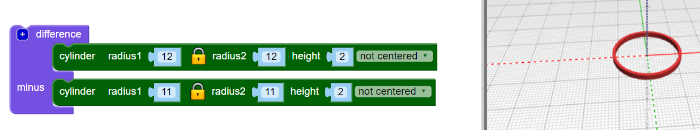

## Crie uma argola

O design usa seis argolas entrelaçadas no centro e uma argola maior ao redor do lado de fora. O pingente tem 4cm de largura, mais a argola para pendurar. Tem 2 mm de espessura, por isso imprimirá em 3D rapidamente.

Primeiro, faça uma argola interna.

--- task ---

Abra o editor BlocksCAD em um navegador da web [blockscad3d.com/editor/](https://www.blockscad3d.com/editor/){:target="_blank"}.

Você pode arrastar e soltar blocos para escrever códigos para criar objetos 3D.

--- /task --- --- task ---

Crie um `cylinder` com um raio de `12` e uma altura de `2` (a unidade aqui é milímetros).

`Cylinders` são automaticamente centralizados ao longo dos eixos X e Y. Selecione `not centered` para que o pingente fique posicionado na superfície. (Isso significa que o valor do eixo Z é maior que 0).

Clique no botão **Render** após cada alteração no seu código para ver os resultados.

--- /task --- --- task ---

Agora, use `difference`{:class="blockscadsetops"} para remover um `cylinder` menor do centro. Isto cria uma argola:

Se preferir, você pode clicar no quadrado colorido para alterar a cor usada no visualizador. Isso não afeta a cor do seu pingente, já que dependerá da cor do filamento que você usar.

--- /task ---
	
	
