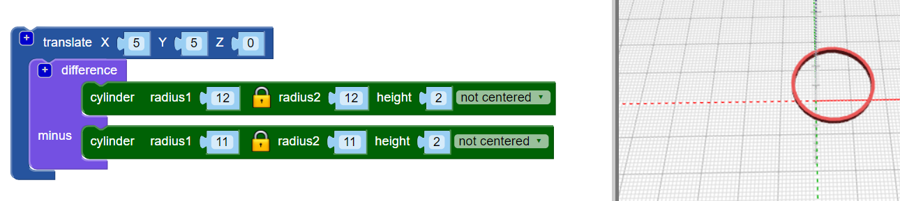
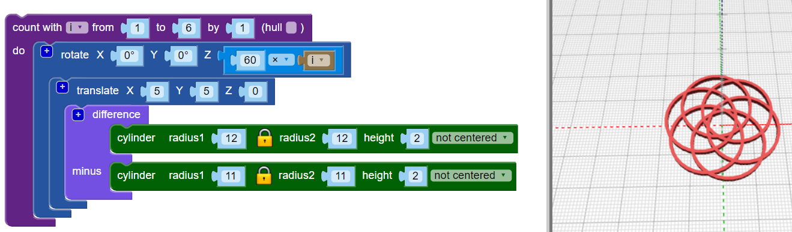

## Adicione mais argolas

O modelo usa seis argolas entrelaçadas, e cada argola se move a partir do centro e gira um número diferente de graus.

--- task ---

Na versão final, não há uma argola central: todas as argolas se distanciaram do centro.

Primeiro, `translate`{:class="blockscadtransforms"} (mova) a primeira argola em posição.

Agora a argola está um pouco fora do centro.

--- /task --- --- task ---

Você precisa de várias cópias desta argola, giradas ao redor do centro. Primeiro, crie três argolas igualmente espaçadas:

Adicione um laço `count`{:class="blockscadloops"} para criar três argolas. Para espaçar as argolas, adicione um bloco `rotate`{:class="blockscadtransforms"} entre o laço `count` e o bloco `translate`. `Count` define a variável `i` de 1 a 3. `Rotate` move cada argola `120 × i` graus, então as três argolas são distribuídas igualmente em torno dos 360 graus de um círculo (360/3 = 120).

Veja o código e certifique-se de entender como ele funciona.

--- /task --- --- task ---

A versão final tem seis argolas ao invés de três. Altere seu código para que crie seis argolas igualmente espaçadas.

--- hints ---
 --- hint ---

Mude o laço `count`{:class="blockscadloops"} para que seja executado seis vezes ao invés de três. As seis argolas precisarão ser espaçadas igualmente em torno dos 360 graus.

--- /hint --- --- hint ---

Você precisa alterar o laço para executar de 1 a 6 e mover-se em múltiplos de 60 graus (360 / 6 = 60):

--- /hint --- --- hint ---

Seu código deve ficar assim:

--- /hint ------ /hints --- --- /task ---	
	
