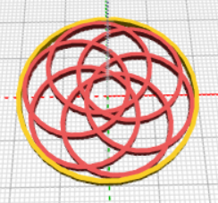
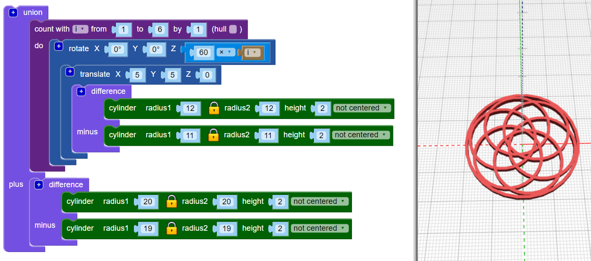

## Adicione uma borda

Em seguida, adicione uma borda ao redor da parte exterior do modelo.

--- task ---

Crie uma argola centralizada que toque as bordas do modelo. Você pode fazer os cálculos para descobrir qual deve ser o raio do círculo, ou criar um círculo e alterar o raio até que funcione. Ambas as abordagem são boas!

Use o bloco `union`{:class="blockscadsetops"} para juntar a borda com as outras argolas:

--- hints --- --- hint ---

Use os blocos `cylinder` e `difference` para fazer a argola.

Cada uma das seis argolas tem um raio de 12mm, portanto o cilindro da borda que você está fazendo precisa ser maior que isso. Você pode tentar definir o raio para 24 mm.

Para fazer uma argola, o raio do segundo `cylinder` no bloco `difference` precisa ser 1mm menor do que o raio do primeiro `cylinder`.

--- /hint --- --- hint ---

Ajuste o tamanho dos `cylinders` até que a argola da borda apenas toque as partes externas das seis argolas de dentro.

--- /hint --- --- hint ---

O raio deve estar em torno de `20`. (Na introdução, dizia que o pingente final terá 40mm de diâmetro!)

Você também pode usar matemática para calcular o diâmetro.

O diâmetro de cada argola interna é de 24mm. Se as argolas se encontrassem no centro do pingente, a argola da borda precisaria ter um raio de 24mm. Mas as argolas de dentro se sobrepõem, porque são movidas 5mm ao longo dos eixos X e Y.

Isso remove uma seção do raio. Esta seção está no arco, a 5mm da origem, então sabemos que precisamos remover 5mm de 24mm. Isso significa que o raio interno da argola da borda deve ser de 19mm.

A matemática é realmente útil quando você necessita ser preciso. Mas é bom apenas mudar as coisas até obter o resultado que você precisa.

--- /hint --- --- /hints --- --- /task ---
