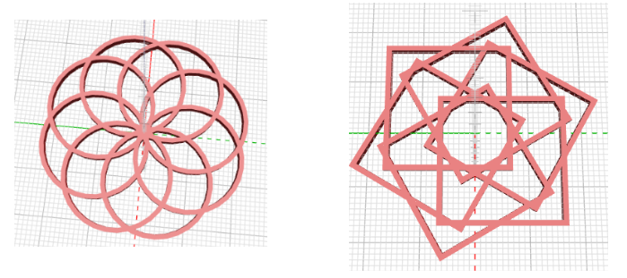

## Desafio: Mude o pingente

--- challenge ---

O modelo é influenciado pelo padrão 'Flor da vida'. Se você quiser, você pode pesquisar a 'Flor da Vida' e ver se você pode criar um projeto com base no padrão 'Semente da Vida'.

--- /challenge ---

--- challenge ---

Experimente e altere alguns valores em seu pingente. Por exemplo, altere o número de argolas, ou a rotação.

Você também pode tentar usar cuboides (cubos) em vez de cilindros para criar um padrão.

--- /challenge ---

